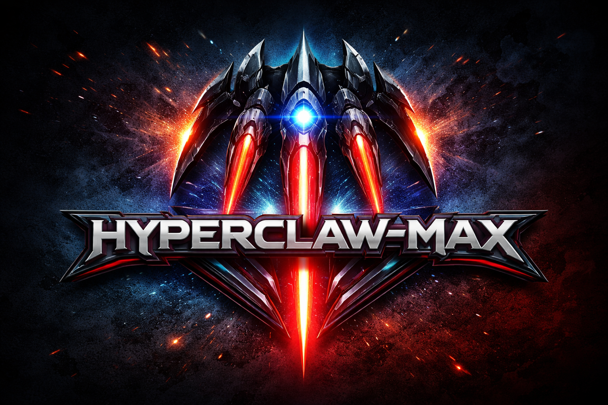
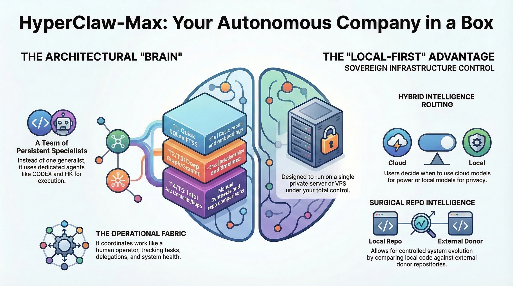
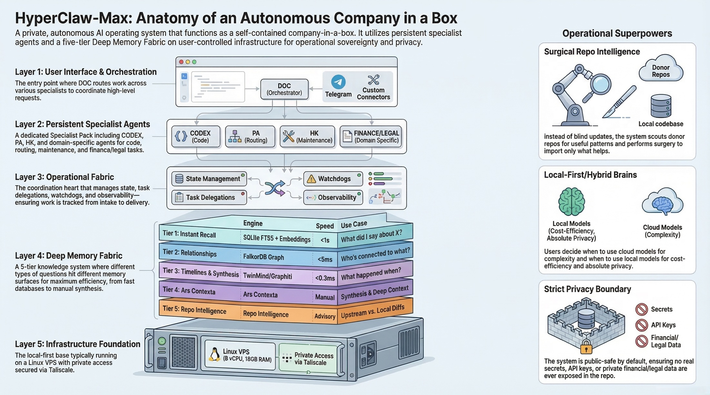
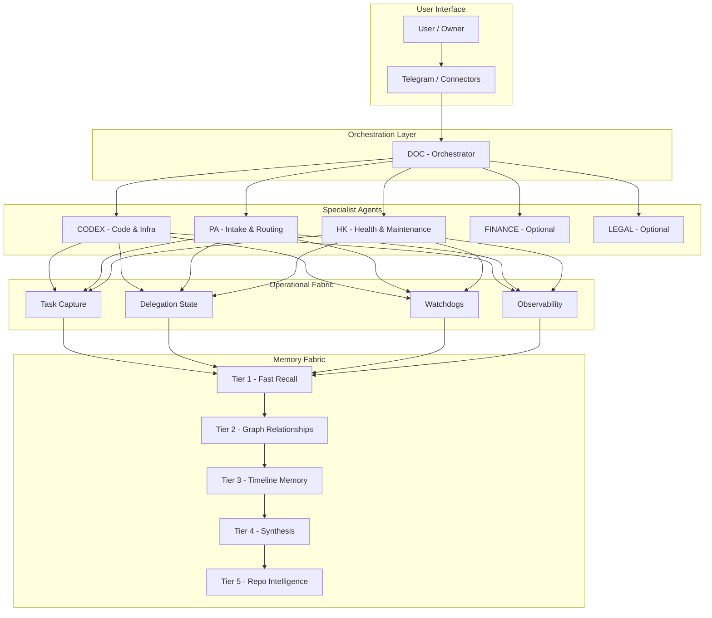

<div align="center">



# ⚡ HYPERCLAW-MAX ⚡

### 🚀 A Local-First Autonomous Company in a Box

**One server. One private network. Persistent agents. Layered memory. Surgical operations.**

[](LICENSE)
[](docs/ROADMAP.md)
[](docs/HOSTING-AND-DEPENDENCIES.md)
[](agents/PACK-MANIFEST.yaml)

[Quick Start](#-quick-start) • [Installation](#-installation-today) • [Architecture](#-architecture) • [Capabilities](#-core-capabilities) • [Documentation](#-documentation)

---

</div>

---

## 🎯 What Is This?

> **Not a chatbot. Not a repo mirror. Not a one-shot coding script.**
>
> **A public-safe distro for running a private AI operator stack on infrastructure you control.**

HyperClaw-Max turns base OpenClaw into a more opinionated operating model for serious operators:
- persistent specialist agents instead of one overloaded generalist
- layered memory instead of flat context
- operational state for tasks, delegations, and watchdogs
- install, validation, and packaging surfaces that can be used and contributed to by third parties

This public repo is meant to be:
- installable from zero
- honest about what is shipped today
- extensible through optional adapters
- usable without any private repo access

<div align="center">



</div>

---

## ✅ What You Get Today

### Public Core Shipped In This Repo

- installable Python package with real CLI entrypoints
- default persistent pack: `DOC`, `CODEX`, `PA`, `HK`
- `first-run` bootstrap over a clean target root
- `materialize-pack` overlay renderer
- public config template plus runtime validation
- operational-fabric bootstrap for tasks, delegations, watchdogs, and summaries
- Stage 1 `context-intel` core
- public-safe systemd templates
- optional `finance` and `legal` overlays

### Optional Adapters And Templates

- Telegram connector template
- HTTP hook template
- Gmail / Calendar example seams
- gateway environment override template
- adapter docs for overlays, connectors, and future packaging lanes

### Not Shipped Yet

- full connector automation
- full voice / browser runtime
- full Tier 2-Tier 5 runtime extraction
- repo-intel adapter implementation
- full gateway parity

---

## ⚡ Quick Start

Two fast paths:

### A. Fastest Path From A Repo Checkout

Best for:
- contributors
- reviewers
- source-level evaluation

```bash
git clone https://github.com/alessiolidoz-hash/HyperClaw-Max.git
cd HyperClaw-Max

TARGET_ROOT=.hyperclaw-max-demo
PYTHONPATH=src python3 -m hyperclaw_max.doctor --repo .
PYTHONPATH=src python3 -m hyperclaw_max.privacy_check --repo .
PYTHONPATH=src python3 -m hyperclaw_max.first_run "$TARGET_ROOT"
PYTHONPATH=src python3 -m hyperclaw_max.runtime_validate "$TARGET_ROOT/config/openclaw.public.example.jsonc"
PYTHONPATH=src python3 -m hyperclaw_max.ops_fabric.cli summary --state-dir "$TARGET_ROOT/runtime/state"
PYTHONPATH=src python3 -m unittest discover -s tests -q
```

### B. Installed CLI Path

Best for:
- operators testing a clean install flow
- users who want package entrypoints instead of `PYTHONPATH=src`

```bash
git clone https://github.com/alessiolidoz-hash/HyperClaw-Max.git
cd HyperClaw-Max

python3 -m venv .venv
. .venv/bin/activate
pip install .

TARGET_ROOT=.hyperclaw-max-demo
hyperclaw-doctor --repo .
hyperclaw-privacy-check --repo .
hyperclaw-first-run "$TARGET_ROOT"
hyperclaw-validate-config "$TARGET_ROOT/config/openclaw.public.example.jsonc"
hyperclaw-ops-fabric summary --state-dir "$TARGET_ROOT/runtime/state"
```

### Optional Smoke

```bash
PYTHONPATH=src python3 -m hyperclaw_max.context_intel.pack "telegram inbound dedupe" --repo . --format human
```

**What this proves:**
- the public core works from a source checkout
- the same surfaces are exposed as installed CLI entrypoints
- the repo passes privacy and validation checks
- the public pack can be materialized on a clean target root

---

## 🛠️ Installation Today

This is the current honest install surface for an external user.

### Prerequisites

| Component | Baseline |
|-----------|----------|
| Host | Linux VPS or local Linux host |
| CPU | ARM64 or x86_64, 8 vCPU recommended |
| RAM | 16 GB recommended |
| Python | 3.11+ |
| Node | 20+ |
| Services | `systemd --user` if using gateway templates |

Core packages:

```bash
apt install -y git ripgrep bash curl
```

Useful during setup:

```bash
apt install -y jq gh
```

### 1. Clone And Install

```bash
git clone https://github.com/alessiolidoz-hash/HyperClaw-Max.git
cd HyperClaw-Max

python3 -m venv .venv
. .venv/bin/activate
pip install .
```

### 2. Bootstrap A Clean Target Root

```bash
TARGET_ROOT=/opt/hyperclaw-max
hyperclaw-first-run "$TARGET_ROOT"
```

This writes:
- `config/openclaw.public.example.jsonc`
- `runtime/state/*.json`
- workspace boot files for the core pack
- pack metadata and materialized overlay state

### 3. Configure The Required Inputs

Edit:
- `"$TARGET_ROOT/config/openclaw.public.example.jsonc"`

For a real runtime, provide your own values for:
- `OPENCLAW_GATEWAY_TOKEN`
- `OPENAI_API_KEY`

Optional but common:
- `ANTHROPIC_API_KEY` if you keep the default fallback model
- `TELEGRAM_BOT_TOKEN` and `TELEGRAM_OWNER_CHAT_ID` if enabling Telegram
- `OPENCLAW_HOOKS_TOKEN` if enabling HTTP hooks
- `GMAIL_WATCH_TOPIC` if enabling the Gmail watch example

Rules:
- keep optional channels disabled until you are ready to configure them
- inject your own keys and tokens after install
- edit the provider section if you want a different model/provider mix than the shipped example

### 4. Validate The Public Core

```bash
hyperclaw-doctor --repo .
hyperclaw-privacy-check --repo .
hyperclaw-validate-config "$TARGET_ROOT/config/openclaw.public.example.jsonc"
hyperclaw-ops-fabric validate --state-dir "$TARGET_ROOT/runtime/state"
hyperclaw-ops-fabric summary --state-dir "$TARGET_ROOT/runtime/state"
python3 -m unittest discover -s tests -q
```

### 5. Add Optional Adapters When Needed

Examples:
- `hyperclaw-materialize-pack "$TARGET_ROOT" --force`
- `hyperclaw-materialize-pack "$TARGET_ROOT" --include-optional finance`
- materialize `finance` or `legal` overlays
- enable Telegram or HTTP hooks
- wire systemd templates for the gateway surface

Useful docs:
- [Onboarding Plan](install/ONBOARDING.md)
- [Connector Templates](install/connectors/README.md)
- [Overlay Materialization](install/overlay/README.md)

> **Current scope:** the public install surface is real for public core bootstrap, validation, and optional template wiring. Connector automation, voice lanes, and repo-intel packaging remain later adapter work.

---

## 🧠 Architecture

<div align="center">



</div>



### Layer Breakdown

| Layer | Purpose | Today In This Repo |
|-------|---------|--------------------|
| User Interface | Entry points | config and connector templates |
| Orchestration | Coordination | default `DOC` pack and workspace boots |
| Specialists | Execution | `DOC`, `CODEX`, `PA`, `HK` plus optional `FINANCE` / `LEGAL` |
| Operational Fabric | State and flow | task, delegation, watchdog state plus validation CLI |
| Memory Fabric | Knowledge surfaces | Stage 1 `context-intel` core and the broader 5-tier model docs |

---

## 🦸 Core Capabilities

### Persistent Specialist Pack

HyperClaw-Max does not assume one assistant does everything.
The default pack is:
- `DOC` for orchestration
- `CODEX` for code and infrastructure
- `PA` for intake and routing
- `HK` for health and maintenance

Optional overlays today:
- `FINANCE`
- `LEGAL`

### Layered Memory Fabric

The product model is a 5-tier memory system:
- Tier 1 for fast recall
- Tier 2 for graph relationships
- Tier 3 for timeline memory
- Tier 4 for synthesis
- Tier 5 for repo intelligence and technical comparison

The public repo ships the Stage 1 `context-intel` core today and documents the broader memory model for future extraction.

### Operational Fabric Base

This repo already ships a public operational base for:
- task state
- delegation state
- watchdog state
- validation and summary commands

That means the public distro is not just prompt-in / answer-out. It already has explicit state and control surfaces for work tracking.

### Local-First Model Routing

The public config template assumes a simple provider path first:
- one primary model
- one fallback model
- clear env-var based credentials

Local and hybrid routing are part of the architecture and proven operating model, but they are not required for a clean public-core install.

### Surgical Repo Intelligence

The long-term goal is controlled self-improvement:
- inspect upstream
- compare local vs external
- import only what helps

Today the public repo ships the `context-intel` core and the repo-intel seam, not the full adapter implementation.

---

## 🔌 Optional Connectors And Adapters

A clean install must work with none of these enabled.

| Surface | Status | What You Provide |
|---------|--------|------------------|
| Telegram | template shipped | your bot token and owner chat ID |
| HTTP hooks | template shipped | your hook token and mappings |
| Gmail / Calendar | example seam | your provider credentials and account mapping |
| Finance / Legal overlays | shipped | explicit opt-in during pack materialization |
| Voice / browser lane | not shipped yet | future adapter packaging |
| Repo-intel adapter | not shipped yet | future adapter packaging |

This is intentional:
- core install first
- optional adapters second
- private overlay never required for public contribution

---

## 🆚 Why Not Just Use OpenClaw?

| Feature | Stock OpenClaw | HyperClaw-Max |
|---------|---------------|---------------|
| Agents | single or ad-hoc | persistent specialist pack |
| Memory | basic | layered model plus public `context-intel` core |
| Operations | minimal | public operational-fabric base |
| Install | DIY | bootstrap, validation, and pack materialization surface |
| Discipline | flexible | role-based pack and install boundaries |

HyperClaw-Max is not a fork for its own sake.
It productizes a more opinionated operating model on top of OpenClaw:
- persistent roles
- staged install
- public-core boundary
- optional adapters instead of hidden private assumptions

---

## ✅ What's Real Today

### Already Working In This Repo

| Component | Status |
|-----------|--------|
| Product architecture | ✅ Real |
| Public config example | ✅ Real |
| `doctor`, `privacy-check`, `validate-config` | ✅ Real |
| `first-run` bootstrap | ✅ Real |
| `materialize-pack` renderer | ✅ Real |
| Gateway unit templates | ✅ Real |
| Operational-fabric schemas and CLI | ✅ Real |
| Stage 1 `context-intel` extraction | ✅ Real |
| Optional `finance` and `legal` overlays | ✅ Real |
| Connector templates | ✅ Real |
| CI workflow and tests | ✅ Real |

### Template-Only Or Later Adapter Lanes

- richer connector automation
- broader local / hybrid routing
- voice and browser services
- repo-intel adapter packaging
- broader memory backend extraction
- richer observability and dispatch wrappers beyond the public base

---

## 📚 Documentation

| Doc | What It Covers |
|-----|----------------|
| [install/ONBOARDING.md](install/ONBOARDING.md) | staged setup path for the public core |
| [docs/CLI.md](docs/CLI.md) | command reference and install surfaces |
| [docs/BOUNDARIES.md](docs/BOUNDARIES.md) | public core vs optional adapters vs private overlay |
| [install/connectors/README.md](install/connectors/README.md) | connector templates and required inputs |
| [install/overlay/README.md](install/overlay/README.md) | pack materialization over a clean base install |
| [docs/ARCHITECTURE.md](docs/ARCHITECTURE.md) | detailed system design |
| [docs/MEMORY-FABRIC.md](docs/MEMORY-FABRIC.md) | layered memory model |
| [docs/OPERATIONAL-FABRIC.md](docs/OPERATIONAL-FABRIC.md) | public task / delegation / watchdog base |
| [docs/HOSTING-AND-DEPENDENCIES.md](docs/HOSTING-AND-DEPENDENCIES.md) | host baseline and dependencies |
| [docs/PRIVACY-AND-SECRETS.md](docs/PRIVACY-AND-SECRETS.md) | secrets handling and privacy rules |
| [docs/BOUNDARY-AUDIT.md](docs/BOUNDARY-AUDIT.md) | public-safety gate and audit scope |
| [docs/ROADMAP.md](docs/ROADMAP.md) | current roadmap |
| [docs/EXTRACTION-MAP.md](docs/EXTRACTION-MAP.md) | copy / rewrite / exclude extraction map |
| [agents/PACK-MANIFEST.yaml](agents/PACK-MANIFEST.yaml) | required and optional agent pack |

---

## 🔒 Privacy And Boundary

This repo is intentionally split into three zones:
- **Public core:** installable and contributable by anyone
- **Optional adapters:** useful but not required for a clean install
- **Private overlay:** secrets, live state, personal data, and operator-specific doctrine

What is never shipped here:
- real API keys or bot tokens
- live sessions or copied runtime state
- personal contacts, calendars, finance, or legal data
- direct copies of private operator memory

For the public distro, the professional rule is simple:
- use your own keys
- enable only the adapters you need
- keep private overlay data outside this repo

See:
- [docs/BOUNDARIES.md](docs/BOUNDARIES.md)
- [docs/PRIVACY-AND-SECRETS.md](docs/PRIVACY-AND-SECRETS.md)
- [docs/BOUNDARY-AUDIT.md](docs/BOUNDARY-AUDIT.md)

---

## 🤝 Contributing

Contribution surfaces are open on the public core:
- install and validation flow
- docs and examples
- pack materialization
- operational-fabric base
- connector templates and optional adapters

Project policies:
- [CONTRIBUTING.md](CONTRIBUTING.md)
- [SECURITY.md](SECURITY.md)
- [CODE_OF_CONDUCT.md](CODE_OF_CONDUCT.md)

---

## 📄 License

[MIT License](LICENSE) — use it, fork it, build on it.

---

<div align="center">

**[📘 Architecture](docs/ARCHITECTURE.md)** • **[⚡ Quick Start](#-quick-start)** • **[🗺️ Roadmap](docs/ROADMAP.md)** • **[⬆ Back to Top](#-hyperclaw-max-)**

</div>
