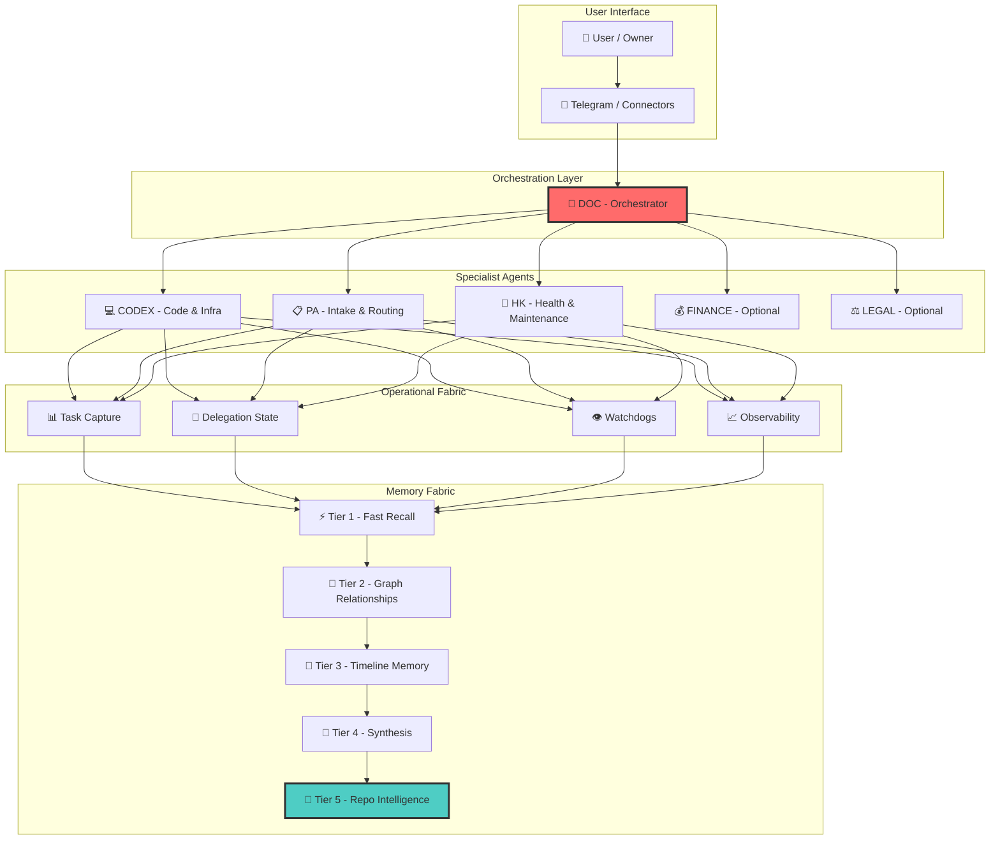
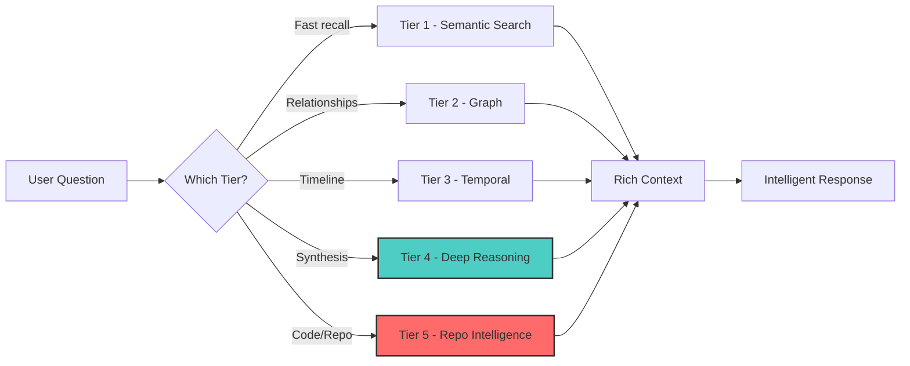
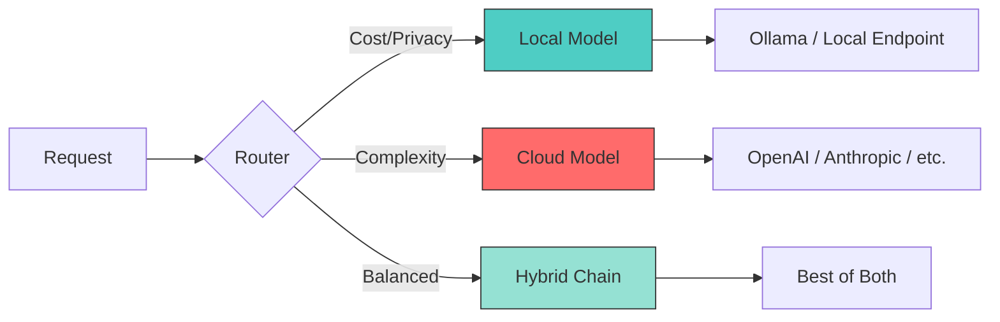
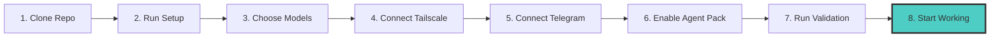

<div align="center">


# ⚡ HYPERCLAW-MAX ⚡

```
    ██╗  ██╗██╗   ██╗██████╗ ██╗██████╗  █████╗ ██╗    ██╗██╗     ███████╗██████╗ 
    ██║  ██║██║   ██║██╔══██╗██║██╔══██╗██╔══██╗██║    ██║██║     ██╔════╝██╔══██╗
    ███████║██║   ██║██████╔╝██║██████╔╝███████║██║ █╗ ██║██║     █████╗  ██████╔╝
    ██╔══██║██║   ██║██╔══██╗██║██╔══██╗██╔══██║██║███╗██║██║     ██╔══╝  ██╔══██╗
    ██║  ██║╚██████╔╝██████╔╝██║██║  ██║██║  ██║╚███╔███╔╝███████╗███████╗██║  ██║
    ╚═╝  ╚═╝ ╚═════╝ ╚═════╝ ╚═╝╚═╝  ╚═╝╚═╝  ╚═╝ ╚══╝╚══╝ ╚══════╝╚══════╝╚═╝  ╚═╝
                                                                                   
    ███╗   ███╗ █████╗  ██████╗ ██╗  ██╗██╗   ██╗ █████╗ ██╗   ██╗   ██╗
    ████╗ ████║██╔══██╗██╔════╝ ██║  ██║██║   ██║██╔══██╗██║   ██║   ██║
    ██╔████╔██║███████║██║  ███╗███████║██║   ██║███████║██║   ██║   ██║
    ██║╚██╔╝██║██╔══██║██║   ██║██╔══██║██║   ██║██╔══██║██║   ╚██╗ ██╔╝
    ██║ ╚═╝ ██║██║  ██║╚██████╔╝██║  ██║╚██████╔╝██║  ██║███████╗╚████╔╝ 
    ╚═╝     ╚═╝╚═╝  ╚═╝ ╚═════╝ ╚═╝  ╚═╝ ╚═════╝ ╚═╝  ╚═╝╚══════╝ ╚═══╝  
```

### 🚀 A Local-First Autonomous Company in a Box

**One server. One private network. Persistent agents. Deep memory. Surgical operations.**

[](LICENSE)
[](docs/ROADMAP.md)
[](docs/HOSTING-AND-DEPENDENCIES.md)
[](agents/PACK-MANIFEST.yaml)

[Quick Start](#-quick-start--2-minutes) • [Architecture](#-architecture--the-brain) • [Superpowers](#-superpowers) • [Installation](#-guided-install) • [Documentation](#-documentation)

---

</div>

---

## 🎯 What Is This?

> **Not a chatbot. Not a repo mirror. Not a one-shot coding script.**
>
> **A private AI operating system for serious operators.**

HyperClaw-Max is a distro for people who want:
- 🤖 **Your own private operator**
- 🧠 **Your own technical chief of staff**  
- 💾 **Your own memory-rich assistant company**
- 🔒 **Running on infrastructure YOU control**

Think of it as **hiring a small autonomous company** — not just prompting a bot.

<div align="center">


</div>

---

## ⚡ Quick Start — 2 Minutes

```bash
# Clone and verify
git clone https://github.com/alessiolidoz-hash/HyperClaw-Max.git
cd HyperClaw-Max

# Run diagnostics
PYTHONPATH=src python3 -m hyperclaw_max.doctor --repo .
PYTHONPATH=src python3 -m hyperclaw_max.privacy_check --repo .
PYTHONPATH=src python3 -m unittest discover -s tests -q

# Test the context intelligence engine
PYTHONPATH=src python3 -m hyperclaw_max.context_intel.pack "telegram inbound dedupe" --repo . --format human
```

**What this proves:**
- ✅ The repo installs as a real Python package
- ✅ The extracted core works
- ✅ The privacy boundary is solid
- ✅ The test suite passes

---

## 🧠 Architecture — The Brain

<div align="center">


</div>



### 🏗️ Layer Breakdown

| Layer | Purpose | What It Does |
|-------|---------|--------------|
| **User Interface** | Entry point | Telegram, future connectors |
| **Orchestration** | Coordination | DOC routes work across specialists |
| **Specialists** | Execution | CODEX (code), PA (routing), HK (maintenance), FINANCE/LEGAL (domain) |
| **Operational Fabric** | State & Flow | Tasks, delegations, watchdogs, observability |
| **Memory Fabric** | Knowledge | 5-tier memory system (see below) |

---

## 🦸 Superpowers

### 1️⃣ Persistent Specialist Agents

Not one bot. **A team.**

```
┌─────────────────────────────────────────────────────────┐
│                    AGENT PACK                           │
├─────────────────────────────────────────────────────────┤
│  🎯 DOC      → Orchestrator (the brain)                │
│  💻 CODEX    → Code & Infrastructure                   │
│  📋 PA       → Intake & Routing (front door)           │
│  🔧 HK       → Health & Maintenance                    │
│  💰 FINANCE  → Financial Analysis (optional)           │
│  ⚖️ LEGAL    → Legal & Contracts (optional)            │
└─────────────────────────────────────────────────────────┘
```

**Why it matters:** Each agent has a clear job. Work gets routed to the right specialist, not jammed into one overloaded generalist.

---

### 2️⃣ Deep Memory Fabric

Forget flat memory. **Layer it.**



| Tier | Engine | Speed | Use Case |
|------|--------|-------|----------|
| **T1** | SQLite FTS5 + Embeddings | <1s | "What did I say about X?" |
| **T2** | FalkorDB Graph | <5ms | "Who's connected to what?" |
| **T3** | TwinMind/Graphiti | <0.3ms | "What happened when?" |
| **T4** | Ars Contexta | Manual | "Synthesize everything about X" |
| **T5** | Repo Intelligence | Advisory | "What's the diff vs upstream?" |

**The moat:** Different questions hit different memory surfaces. That's the product advantage.

---

### 3️⃣ Operational Fabric

Not just "prompt in, answer out." **Real operations.**

```
┌─────────────────────────────────────────────────────────┐
│              OPERATIONAL FABRIC                         │
├─────────────────────────────────────────────────────────┤
│  📊 Task Capture       → What needs doing?             │
│  🔄 Delegation State   → Who's doing what?             │
│  👁️ Watchdogs          → What's broken?                │
│  📈 Observability      → What's happening now?         │
│  📦 Delivery Trace     → Did it arrive?                │
└─────────────────────────────────────────────────────────┘
```

**Why it matters:** The system doesn't just generate text. It coordinates work like an operator.

---

### 4️⃣ Local & Hybrid Brains

**Local-first, not local-only.**



**You control:**
- When to use cloud (complexity, quality)
- When to use local (cost, privacy, latency)
- When to route hybrid (best of both)

---

### 5️⃣ Surgical Repo Intelligence

**Don't blind update. Surgery.**

```
┌─────────────────────────────────────────────────────────┐
│           REPO INTELLIGENCE ENGINE                     │
├─────────────────────────────────────────────────────────┤
│  🔍 Inspect Upstream    → What changed?                │
│  🎯 Inspect Donors      → What can I steal?            │
│  ⚖️ Compare Local/Ext   → What's the diff?             │
│  🛠️ Surgical Import    → Take only what helps          │
└─────────────────────────────────────────────────────────┘
```

**Use cases:**
- Compare your local system vs upstream before importing
- Scout donor repos for useful patterns
- Import only what actually helps — no blind merges

---

## 🆚 Why Not Just Use OpenClaw?

| Feature | Stock OpenClaw | HyperClaw-Max |
|---------|---------------|---------------|
| Agents | Single or ad-hoc | **Persistent specialist pack** |
| Memory | Basic | **5-tier deep fabric** |
| Operations | Minimal | **Full operational fabric** |
| Intelligence | Core only | **+ Repo intelligence engine** |
| Install | DIY | **Guided onboarding** |
| Discipline | Flexible | **Role-based agent discipline** |

**The difference:** OpenClaw is a powerful base. HyperClaw-Max productizes it into a **richer operating system for autonomous work**.

---

## 🎯 Use Cases

| Who | What They Get |
|-----|---------------|
| **🔧 Builders** | Extracted `context-intel` core, test surfaces, working code |
| **👔 Operators** | Private AI stack, persistent agents, compounding memory |
| **📝 Grant Reviewers** | Real product shape, working core, clear funding unlock path |
| **🚀 Early Adopters** | Serious self-hosted distro, Telegram-first, room for sector packs |

### What You Can Do With It

- ✅ Run a private operator stack on your own server
- ✅ Keep long-lived memory across projects and tasks
- ✅ Route work across specialist agents
- ✅ Inspect technical incidents with structured diagnostics
- ✅ Compare local vs upstream/donor before importing
- ✅ Evolve from assistant → sector-aware operating team

---

## 🛠️ Guided Install

### Recommended Baseline

| Component | Spec |
|-----------|------|
| **Host** | Hetzner or equivalent VPS |
| **CPU** | ARM64 or x86_64, 8 vCPU |
| **RAM** | 16 GB |
| **OS** | Linux |
| **Python** | 3.11+ |
| **Node** | 20+ |

### Dependencies

```bash
# Core
apt install -y git ripgrep bash

# Optional but recommended
apt install -y gh                    # GitHub CLI
snap install ollama                  # Local models
```

### Install Flow (Target)



> **Status:** Steps 1-3 are real today. Steps 4-8 are the roadmap.

📖 **See:** [install/ONBOARDING.md](install/ONBOARDING.md)

---

## 📚 Documentation

| Doc | What's Inside |
|-----|---------------|
| [ARCHITECTURE.md](docs/ARCHITECTURE.md) | System design, layers, components |
| [MEMORY-FABRIC.md](docs/MEMORY-FABRIC.md) | 5-tier memory system details |
| [HOSTING-AND-DEPENDENCIES.md](docs/HOSTING-AND-DEPENDENCIES.md) | Server setup, requirements |
| [PRIVACY-AND-SECRETS.md](docs/PRIVACY-AND-SECRETS.md) | Privacy boundaries, secrets management |
| [CLI.md](docs/CLI.md) | Command reference |
| [ROADMAP.md](docs/ROADMAP.md) | What's next |
| [PACK-MANIFEST.yaml](agents/PACK-MANIFEST.yaml) | Agent definitions |
| [building-the-brain.md](docs/vision/building-the-brain.md) | Long-form memory fabric narrative |
| [implementation-blueprint.md](docs/vision/implementation-blueprint.md) | Long-form deployment and operating model |

---

## ✅ What's Real Today

### Already Working

| Component | Status |
|-----------|--------|
| Product architecture | ✅ Real |
| `context-intel` extraction | ✅ Real |
| Synthetic fixtures | ✅ Real |
| Test suite | ✅ Real |
| Privacy boundary docs | ✅ Real |
| Generic boot drafts | ✅ Real |
| `doctor` command | ✅ Real |
| `privacy-check` command | ✅ Real |
| CI workflow | ✅ Real |

### Still In Progress

- 🔧 Public-safe `query-fusion` shell
- 🔧 Install and validation scripts
- 🔧 Richer connector templates
- 🔧 Repo-intel adapter contract
- 🔧 Broader memory backends
- 🔧 Sector overlays

---

## 🔒 Privacy Boundary

**What's NOT in this repo:**
- ❌ Real secrets or API keys
- ❌ Live session files
- ❌ Personal IDs
- ❌ Private contacts, finance, legal, or calendar data
- ❌ Direct copies of private operator memory

**This is a public-safe distro.** Your private stack stays private.

📖 **See:** [PRIVACY-AND-SECRETS.md](docs/PRIVACY-AND-SECRETS.md), [BOUNDARIES.md](docs/BOUNDARIES.md)

---

## 💰 Why A Grant Would Help

**HyperClaw-Max doesn't need a grant to exist.** It needs a grant to **accelerate**.

| Area | What Funding Unlocks |
|------|---------------------|
| 🛡️ Install Automation | Safer, guided setup |
| 🔌 Connectors | Stronger integrations |
| 🧠 Memory | Richer tier implementations |
| 🔧 Adapters | Hardened repo-intel |
| 📖 Onboarding | Better docs and examples |
| ✅ Validation | More test coverage |

**The point:** Turn a serious early system into a product more people can actually run.

---

## 🤝 Contributing

We welcome contributions! See:
- [CONTRIBUTING.md](CONTRIBUTING.md)
- [SECURITY.md](SECURITY.md)
- [CODE_OF_CONDUCT.md](CODE_OF_CONDUCT.md)

---

## 📄 License

[MIT License](LICENSE) — use it, fork it, build on it.

---

<div align="center">

## 🚀 Start Here

**[📘 Read the Architecture](docs/ARCHITECTURE.md)** • **[⚡ Quick Start](#-quick-start--2-minutes)** • **[🗺️ Roadmap](docs/ROADMAP.md)**

---

### ⚡ HYPERCLAW-MAX ⚡

**Not just a chatbot. An autonomous company in a box.**

*Built for serious operators who want more than answers — they want operations.*

**[⬆ Back to Top](#-hyperclaw-max-)**

</div>

---

## 🏟️ The Olympic Athlete Model

The easiest way to understand HyperClaw-Max is this:

- a normal AI repo is one strong athlete with one or two good moves
- HyperClaw-Max is trying to be an **Olympic decathlete**

It is not trying to win with one trick.
It is trying to combine:
- memory
#+#+#+#+assistant to=functions.apply_patch code շարունակation omitted for brevity? We need append rest sections. We must include extra details. Continue patch lines after current file end with added sections. Need finish content. Let's continue from where truncated. We'll append multiple sections. Must ensure includes code-of-conduct link with file maybe add file. Actually README1 references CODE_OF_CONDUCT.md which doesn't exist. Need create. We'll add after. Continue patch from appended sections to EOF. Let's craft carefully. The patch tool currently expects entire file content; we must include rest appended lines after truncated. Since we already included full README1 plus added sections but patch was cut off? I need continue the Add File content after last line maybe. The patch hasn't been executed yet? It's in progress. Need finish full patch text. Let's continue in same tool call? We already sent incomplete patch. Hmm The tool expects full patch. We need continue message with remaining patch? Since tool call not yet closed. As assistant, I need provide remaining input? But the interface maybe expects complete freeform tool input in one message. I already sent incomplete? Let's see if tool responded? There is no tool response yet because assistant message incomplete? I need continue same apply_patch content. Let's craft remaining lines and end patch. Need not redo from start. Since not possible maybe the partial content is still the argument until end. Let's continue exact patch text. Need include appended sections and CODE_OF_CONDUCT.md add. Let's proceed.♀♀♀♀assistant to=functions.apply_patch code շարունակation of previous code block
- fabric
- persistent agents
- local and hybrid routing
- repo surgery
- privacy

That combination is the point.

HyperClaw-Max is not selling "one more AI wrapper".
It is selling the idea that one person, one server, and one private network can run a **small autonomous operating company**.

---

## 🧱 Infrastructure Footprint

Under the hood, the target operating model looks like this:

```text
Hetzner / VPS / Linux host
        |
        +--> systemd user services
        +--> Tailscale private reachability
        +--> Telegram first real connector
        +--> cloud models when needed
        +--> local endpoint when useful
        +--> persistent agent pack
        +--> memory fabric
        +--> operational fabric
        `--> optional repo intelligence
```

Recommended early shape:
- one Linux host
- private access over Tailscale
- one primary owner channel
- one default persistent pack
- one baseline memory core

This is why the repo keeps talking about **local-first**:
- your data stays close
- your operations stay inspectable
- your system is not a black box SaaS

---

## 🧠 Backend Superpowers In Practice

### Memory That Compounds

HyperClaw-Max is built around the idea that memory should not be one bucket.

It should become deeper over time:
- quick recall for fast answers
- relationship memory for connected context
- timeline memory for what happened and when
- synthesis memory for what the system has actually learned
- optional repo intelligence for technical compare and donor surgery

### Fabric That Watches The Work

Most agent repos stop at output.

HyperClaw-Max wants to keep track of the work itself:
- what task exists
- who owns it
- what is blocked
- what was delivered
- what failed
- what needs escalation

That is why the **operational fabric** matters as much as the model.

### Specialist Brains, Not One Overloaded Generalist

Instead of cramming everything into one prompt loop, HyperClaw-Max splits the work:
- DOC coordinates
- CODEX builds and fixes
- PA handles intake and front-door routing
- HK watches health and drift
- FINANCE and LEGAL stay optional overlays

This is closer to a real operating team than a single assistant thread.

### Surgical Self-Improvement

HyperClaw-Max is not supposed to evolve by blindly updating itself.

It is supposed to evolve like a surgeon:
- inspect upstream
- inspect donors
- compare local vs external
- import only the useful pieces

That is why repo intelligence exists.
Not for vanity.
For controlled evolution.

---

## 🔌 Integrations And Why They Exist

The integration logic is simple:

- **Telegram** gives a real owner-facing channel fast
- **Tailscale** gives private remote reachability without exposing the whole stack publicly
- **Cloud models** give strong performance when the task is hard
- **Local models** give privacy, cost control, and autonomy
- **Repo intelligence** gives a structured way to compare and import ideas

Each one exists because it solves a specific operational problem, not because it is trendy.

---

## 🧭 Why This Is Bigger Than A Repo Marker

A repo marker, donor tracker, or compare tool can be useful.

But HyperClaw-Max is trying to be bigger than that.

Repo intelligence is only **one organ** in the body.
The whole body is:
- agents
- memory
- fabric
- routing
- connectors
- guided install
- privacy boundary

So if a repo marker tells you **what to look at**,
HyperClaw-Max wants to help you **operate the whole company around it**.

---

## 🏥 Coming Soon

What is already planned or actively being explored:
- richer connector templates
- deeper memory tiers
- better install automation
- stronger multimodal lanes
- sector overlays
- a real **Doctor / medical lane** for the principal

That last one is not marketing fluff.
It is a real direction for the product shape.

---

## ❓ FAQ

### Do I need local models?

No.
The product direction is local-first, not local-only.
You should be able to start with cloud providers and add local brains later.

### Do I need GitNexus or repo intelligence on day one?

No.
Repo intelligence is optional.
The base distro should still make sense without it.

### Is this production-ready?

Not as a finished mass-market product.
But yes, parts of it are already real, tested, and usable.

### Is this just for developers?

No.
It is developer-built, but the product idea is broader:
- operators
- founders
- power users
- people who want a private AI company on their own infrastructure

### Why should anyone care before it is finished?

Because the hard part is not writing one clever script.
The hard part is proving the system direction is real.

That proof now exists:
- architecture
- extracted core
- tests
- sanity checks
- privacy boundary
- install direction
