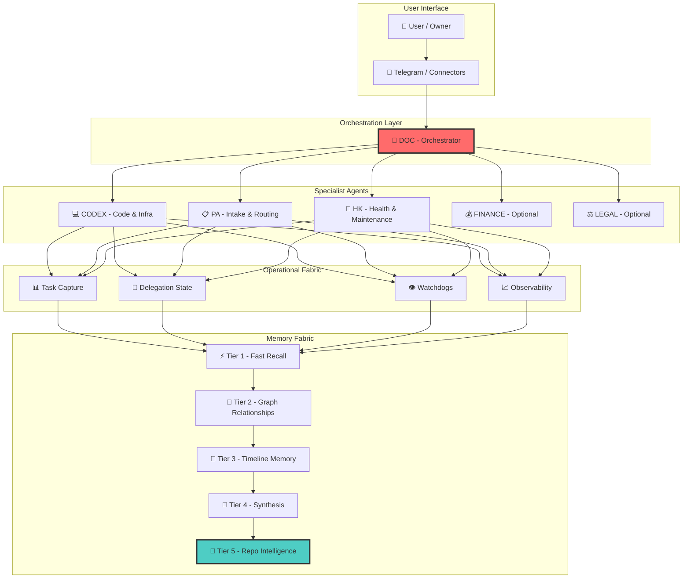
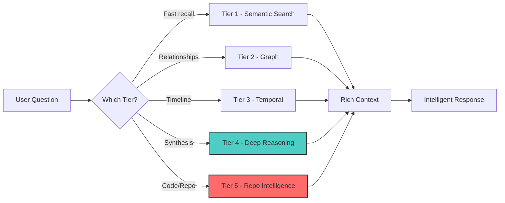
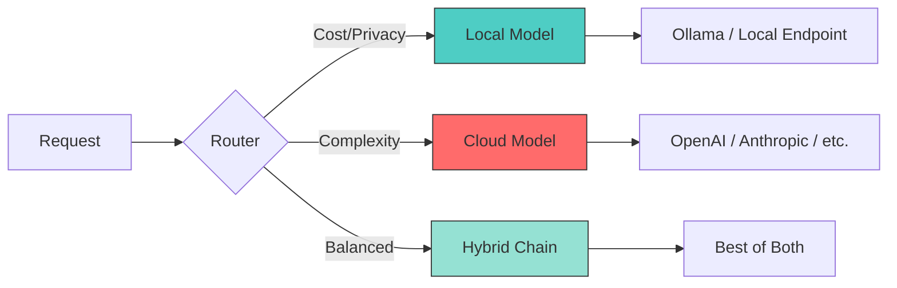
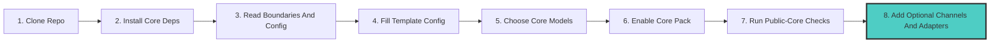

<div align="center">


# ⚡ HYPERCLAW-MAX ⚡

### 🚀 A Local-First Autonomous Company in a Box

**One server. One private network. Persistent agents. Deep memory. Surgical operations.**

[](LICENSE)
[](docs/ROADMAP.md)
[](docs/HOSTING-AND-DEPENDENCIES.md)
[](agents/PACK-MANIFEST.yaml)

[Quick Start](#-quick-start) • [Architecture](#-architecture--the-brain) • [Superpowers](#-superpowers) • [Installation](#-installation-today) • [Documentation](#-documentation)

---

</div>

---

## 🎯 What Is This?

> **Not a chatbot. Not a repo mirror. Not a one-shot coding script.**
>
> **A private AI operating system for serious operators.**

HyperClaw-Max is a distro for people who want:
- 🤖 **Your own private operator**
- 🧠 **Your own technical chief of staff**  
- 💾 **Your own memory-rich assistant company**
- 🔒 **Running on infrastructure YOU control**

Think of it as **hiring a small autonomous company** — not just prompting a bot.

## ✅ What You Get Today

**Public core already shipped in this repo:**
- installable Python package with real CLI entrypoints
- `first-run` bootstrap and pack materialization
- public config template plus runtime validation
- operational-fabric bootstrap for tasks, delegations, and watchdog state
- Stage 1 `context-intel` core
- optional finance/legal boot overlays

**Not shipped yet in the public repo:**
- full connector automation
- full voice/browser runtime
- full Tier 2-Tier 5 memory runtime
- repo-intel adapter implementation
- full gateway/runtime parity with the private body

<div align="center">


</div>

---

## ⚡ Quick Start

Two fast paths:

### A. Fastest Path From A Repo Checkout

Best for:
- contributors
- reviewers
- local evaluation from source

```bash
git clone https://github.com/alessiolidoz-hash/HyperClaw-Max.git
cd HyperClaw-Max

TARGET_ROOT=.hyperclaw-max-demo
PYTHONPATH=src python3 -m hyperclaw_max.doctor --repo .
PYTHONPATH=src python3 -m hyperclaw_max.privacy_check --repo .
PYTHONPATH=src python3 -m hyperclaw_max.first_run "$TARGET_ROOT"
PYTHONPATH=src python3 -m hyperclaw_max.runtime_validate "$TARGET_ROOT/config/openclaw.public.example.jsonc"
PYTHONPATH=src python3 -m hyperclaw_max.ops_fabric.cli summary --state-dir "$TARGET_ROOT/runtime/state"
PYTHONPATH=src python3 -m unittest discover -s tests -q
```

### B. Installed CLI Path

Best for:
- operators evaluating a clean install flow
- users who want the package entrypoints rather than `PYTHONPATH=src`

```bash
git clone https://github.com/alessiolidoz-hash/HyperClaw-Max.git
cd HyperClaw-Max

python3 -m venv .venv
. .venv/bin/activate
pip install .

TARGET_ROOT=.hyperclaw-max-demo
hyperclaw-doctor --repo .
hyperclaw-privacy-check --repo .
hyperclaw-first-run "$TARGET_ROOT"
hyperclaw-validate-config "$TARGET_ROOT/config/openclaw.public.example.jsonc"
hyperclaw-ops-fabric summary --state-dir "$TARGET_ROOT/runtime/state"
```

### Optional Smoke

```bash
PYTHONPATH=src python3 -m hyperclaw_max.context_intel.pack "telegram inbound dedupe" --repo . --format human
```

**What this proves:**
- ✅ The public core works from a source checkout
- ✅ The same surfaces are exposed as installed CLI entrypoints
- ✅ The privacy boundary is solid
- ✅ The public core can be materialized on a clean target root
- ✅ The public config and ops-fabric base validate
- ✅ The shipped test suite passes

---

## 🧠 Architecture — The Brain

<div align="center">


</div>



### 🏗️ Layer Breakdown

| Layer | Purpose | What It Does |
|-------|---------|--------------|
| **User Interface** | Entry point | Telegram, future connectors |
| **Orchestration** | Coordination | DOC routes work across specialists |
| **Specialists** | Execution | CODEX (code), PA (routing), HK (maintenance), FINANCE/LEGAL (domain) |
| **Operational Fabric** | State & Flow | Tasks, delegations, watchdogs, observability |
| **Memory Fabric** | Knowledge | 5-tier memory system (see below) |

---

## 🏟️ The Olympic Athlete Model

The easiest way to understand HyperClaw-Max is this:

- a normal AI repo is one strong athlete with one or two good moves
- HyperClaw-Max is trying to be an **Olympic decathlete**

It is not trying to win with one trick.
It is trying to combine:
- memory
- fabric
- persistent agents
- local and hybrid routing
- repo surgery
- privacy

That combination is the point.

HyperClaw-Max is not selling "one more AI wrapper".
It is selling the idea that one person, one server, and one private network can run a **small autonomous operating company**.

---

## 🦸 Superpowers

### 1️⃣ Persistent Specialist Agents

Not one bot. **A team.**

```
┌─────────────────────────────────────────────────────────┐
│                    AGENT PACK                           │
├─────────────────────────────────────────────────────────┤
│  🎯 DOC      → Orchestrator (the brain)                │
│  💻 CODEX    → Code & Infrastructure                   │
│  📋 PA       → Intake & Routing (front door)           │
│  🔧 HK       → Health & Maintenance                    │
│  💰 FINANCE  → Financial Analysis (optional)           │
│  ⚖️ LEGAL    → Legal & Contracts (optional)            │
└─────────────────────────────────────────────────────────┘
```

**Why it matters:** Each agent has a clear job. Work gets routed to the right specialist, not jammed into one overloaded generalist.

---

### 2️⃣ Deep Memory Fabric

Forget flat memory. **Layer it.**



| Tier | Engine | Speed | Use Case |
|------|--------|-------|----------|
| **T1** | SQLite FTS5 + Embeddings | <1s | "What did I say about X?" |
| **T2** | FalkorDB Graph | <5ms | "Who's connected to what?" |
| **T3** | TwinMind/Graphiti | <0.3ms | "What happened when?" |
| **T4** | Ars Contexta | Manual | "Synthesize everything about X" |
| **T5** | Repo Intelligence | Advisory | "What's the diff vs upstream?" |

**The moat:** Different questions hit different memory surfaces. That's the product advantage.

**Reference stack in the private system today:**
- **Tier 1:** SQLite FTS5 + **EmbeddingGemma 300M**
- **Tier 2:** **FalkorDB** relationship graph
- **Tier 3:** **TwinMind / Graphiti** timeline layer
- **Tier 4:** **Ars Contexta** synthesis layer
- **Tier 5:** optional repo-intelligence and upstream advisory

---

### 3️⃣ Operational Fabric

Not just "prompt in, answer out." **Real operations.**

```
┌─────────────────────────────────────────────────────────┐
│              OPERATIONAL FABRIC                         │
├─────────────────────────────────────────────────────────┤
│  📊 Task Capture       → What needs doing?             │
│  🔄 Delegation State   → Who's doing what?             │
│  👁️ Watchdogs          → What's broken?                │
│  📈 Observability      → What's happening now?         │
│  📦 Delivery Trace     → Did it arrive?                │
└─────────────────────────────────────────────────────────┘
```

**Why it matters:** The system doesn't just generate text. It coordinates work like an operator.

---

### 4️⃣ Local & Hybrid Brains

**Local-first, not local-only.**



**You control:**
- When to use cloud (complexity, quality)
- When to use local (cost, privacy, latency)
- When to route hybrid (best of both)

**Reference routing stack in the private system:**
- strong cloud models for hard reasoning
- local endpoints for privacy and cost control
- local **EmbeddingGemma** for Tier 1 recall
- local and hybrid lanes for deeper indexing and memory maintenance

---

### 5️⃣ Surgical Repo Intelligence

**Don't blind update. Surgery.**

```
┌─────────────────────────────────────────────────────────┐
│           REPO INTELLIGENCE ENGINE                     │
├─────────────────────────────────────────────────────────┤
│  🔍 Inspect Upstream    → What changed?                │
│  🎯 Inspect Donors      → What can I steal?            │
│  ⚖️ Compare Local/Ext   → What's the diff?             │
│  🛠️ Surgical Import    → Take only what helps          │
└─────────────────────────────────────────────────────────┘
```

**Use cases:**
- Compare your local system vs upstream before importing
- Scout donor repos for useful patterns
- Import only what actually helps — no blind merges

---

## 🧠 Backend Superpowers In Practice

### Memory That Compounds

HyperClaw-Max is built around the idea that memory should not be one bucket.

It should become deeper over time:
- quick recall for fast answers
- relationship memory for connected context
- timeline memory for what happened and when
- synthesis memory for what the system has actually learned
- optional repo intelligence for technical compare and donor surgery

### Fabric That Watches The Work

Most agent repos stop at output.

HyperClaw-Max wants to keep track of the work itself:
- what task exists
- who owns it
- what is blocked
- what was delivered
- what failed
- what needs escalation

That is why the **operational fabric** matters as much as the model.

### Specialist Brains, Not One Overloaded Generalist

Instead of cramming everything into one prompt loop, HyperClaw-Max splits the work:
- DOC coordinates
- CODEX builds and fixes
- PA handles intake and front-door routing
- HK watches health and drift
- FINANCE and LEGAL stay optional overlays

This is closer to a real operating team than a single assistant thread.

### Surgical Self-Improvement

HyperClaw-Max is not supposed to evolve by blindly updating itself.

It is supposed to evolve like a surgeon:
- inspect upstream
- inspect donors
- compare local vs external
- import only the useful pieces

That is why repo intelligence exists.
Not for vanity.
For controlled evolution.

---

## 🧱 Infrastructure Footprint

Under the hood, the target operating model looks like this:

```text
Linux host / VPS
        |
        +--> systemd user services
        +--> private network boundary
        +--> patch-aware gateway control plane
        +--> model providers + optional local endpoint
        +--> persistent public-core pack
        +--> memory fabric
        +--> operational fabric
        +--> hook / connector adapters
        +--> optional voice / browser line
        `--> optional repo intelligence
```

Recommended early shape:
- one Linux host
- one private network path
- one default persistent pack
- one baseline memory and diagnostic core
- one real validation surface
- connectors enabled only when configured

**Reference deployment already proven in the private system:**
- single Linux VPS
- ARM64 or x86_64
- 8 vCPU
- 16 GB RAM
- systemd user services
- private network boundary

This is why the repo keeps talking about **local-first**:
- your data stays close
- your operations stay inspectable
- your system is not a black box SaaS

Important packaging truth:
- the live private body already proves more than the public repo currently ships
- `HyperClaw-Max` is already real as a package and doc set
- it is not yet the fully extracted public distro of the live body

---

## 🔌 Integrations And Why They Exist

The integration logic is simple:

- **Telegram** gives a real owner-facing channel fast
- **Tailscale** gives private remote reachability without exposing the whole stack publicly
- **Cloud models** give strong performance when the task is hard
- **Local models** give privacy, cost control, and autonomy
- **Hooks** give a clean way to bridge email/calendar/drive style ingress
- **Repo intelligence** gives a structured way to compare and import ideas
- **Voice adapters** are the future seam for voice and RTC lanes

**Public repo today:**
- Telegram, HTTP hook, Gmail-watch, and calendar-push templates
- public-safe systemd templates
- optional finance/legal overlays
- context-intel core and operational-fabric base

**Live private body additionally proves:**
- richer Telegram / WhatsApp flows
- Gmail / Calendar / Drive hook ingress
- voice/browser services
- repo-intel advisory lanes

**Public repo truth right now:**
- the docs describe these surfaces because they are real in the body
- the repo already ships the Stage 1 core and trust layer
- connector, voice, and richer fabric packaging are still an extraction roadmap, not a finished install surface

Each one exists because it solves a specific operational problem, not because it is trendy.

---

## 🆚 Why Not Just Use OpenClaw?

| Feature | Stock OpenClaw | HyperClaw-Max |
|---------|---------------|---------------|
| Agents | Single or ad-hoc | **Persistent specialist pack** |
| Memory | Basic | **Layered model + public context-intel core** |
| Operations | Minimal | **Public operational-fabric base** |
| Intelligence | Core only | **Context-intel core + repo-intel seam** |
| Install | DIY | **Public-core bootstrap and validation surface** |
| Discipline | Flexible | **Role-based agent discipline** |

**The difference:** OpenClaw is a powerful base. HyperClaw-Max productizes it into a **richer operating system for autonomous work**.

---

## 🧭 Why This Is Bigger Than A Repo Marker

A repo marker, donor tracker, or compare tool can be useful.

But HyperClaw-Max is trying to be bigger than that.

Repo intelligence is only **one organ** in the body.
The whole body is:
- agents
- memory
- fabric
- routing
- connectors
- guided install
- privacy boundary

So if a repo marker tells you **what to look at**,
HyperClaw-Max wants to help you **operate the whole company around it**.

---

## 🎯 Use Cases

| Who | What They Get |
|-----|---------------|
| **🔧 Builders** | Extracted `context-intel` core, test surfaces, working code |
| **👔 Operators** | Local-first public core, persistent agents, clear install boundary |
| **🧪 Technical Evaluators** | Real product surface, validation commands, clean-room install path |
| **🚀 Early Adopters** | Serious self-hosted distro with optional adapter lanes |

### What You Can Do With It

- ✅ Bootstrap a private operator stack on your own server
- ✅ Materialize a persistent core pack from a clean target root
- ✅ Keep long-lived memory across projects and tasks
- ✅ Validate config and runtime state before expanding the install
- ✅ Route work across a persistent specialist core pack
- ✅ Inspect technical incidents with structured diagnostics
- ✅ Compare local vs upstream/donor before importing
- ✅ Contribute to the public core without touching the private body

---

## 🛠️ Installation Today

### Recommended Baseline

| Component | Spec |
|-----------|------|
| **Host** | Hetzner or equivalent VPS |
| **CPU** | ARM64 or x86_64, 8 vCPU |
| **RAM** | 16 GB |
| **OS** | Linux |
| **Python** | 3.11+ |
| **Node** | 20+ |

### Dependencies

```bash
# Core
apt install -y git ripgrep bash curl

# Useful during setup
apt install -y jq gh
```

### Install Flow



> **Status:** Steps 1-7 describe the current public-core pass. Connector, voice, repo-intel, and richer fabric lanes are still being extracted from the live body.

📖 **See:** [install/ONBOARDING.md](install/ONBOARDING.md)

---

## 📚 Documentation

| Doc | What's Inside |
|-----|---------------|
| [install/ONBOARDING.md](install/ONBOARDING.md) | Real staged setup path for the public core |
| [docs/BOUNDARIES.md](docs/BOUNDARIES.md) | Core vs optional vs private overlay boundary |
| [install/connectors/README.md](install/connectors/README.md) | Optional connector templates |
| [install/overlay/README.md](install/overlay/README.md) | Pack materialization over a clean target root |
| [ARCHITECTURE.md](docs/ARCHITECTURE.md) | System design, layers, components |
| [MEMORY-FABRIC.md](docs/MEMORY-FABRIC.md) | 5-tier memory system details |
| [HOSTING-AND-DEPENDENCIES.md](docs/HOSTING-AND-DEPENDENCIES.md) | Server setup, requirements |
| [PRIVACY-AND-SECRETS.md](docs/PRIVACY-AND-SECRETS.md) | Privacy boundaries, secrets management |
| [BOUNDARY-AUDIT.md](docs/BOUNDARY-AUDIT.md) | Current public-safety gate and audit scope |
| [CLI.md](docs/CLI.md) | Command reference |
| [OPERATIONAL-FABRIC.md](docs/OPERATIONAL-FABRIC.md) | Public task / delegation / watchdog base |
| [ROADMAP.md](docs/ROADMAP.md) | What's next |
| [PACK-MANIFEST.yaml](agents/PACK-MANIFEST.yaml) | Agent definitions |
| [building-the-brain.md](docs/vision/building-the-brain.md) | Long-form memory fabric narrative |
| [implementation-blueprint.md](docs/vision/implementation-blueprint.md) | Long-form deployment and operating model |

---

## ✅ What's Real Today

### Already Working In This Repo

| Component | Status |
|-----------|--------|
| Product architecture | ✅ Real |
| `context-intel` extraction | ✅ Real |
| Synthetic fixtures | ✅ Real |
| Test suite | ✅ Real |
| Privacy boundary docs | ✅ Real |
| Generic boot drafts | ✅ Real |
| Public extraction map | ✅ Real |
| Public config example | ✅ Real |
| First-run bootstrap + manual config completion | ✅ Real |
| Gateway unit templates | ✅ Real |
| Operational-fabric schemas and bootstrap CLI | ✅ Real |
| Materialize-pack CLI | ✅ Real |
| First-run bootstrap CLI | ✅ Real |
| Optional connector templates | ✅ Real |
| Boundary audit doc and checks | ✅ Real |
| `doctor` command | ✅ Real |
| `privacy-check` command | ✅ Real |
| `validate-config` command | ✅ Real |
| `ops-fabric` command | ✅ Real |
| CI workflow | ✅ Real |

### Real In The Live Body, Not Yet Fully Extracted Here

- patch-aware control plane
- richer operational fabric beyond the public base
- hook and connector surfaces
- local and hybrid routing layers
- voice and browser line
- Tier 5 compare and sync workflows

### Still In Progress For The Public Distro

- 🔧 Public-safe `query-fusion` shell
- 🔧 Dispatch, watchdog, and observability wrappers beyond the public base
- 🔧 Richer connector automation beyond the shipped templates
- 🔧 Voice/browser adapter packaging
- 🔧 Repo-intel adapter contract
- 🔧 Broader memory backends
- 🔧 Sector overlays

---

## 🔒 Privacy Boundary

**What's NOT in this repo:**
- ❌ Real secrets or API keys
- ❌ Live session files
- ❌ Personal IDs
- ❌ Private contacts, finance, legal, or calendar data
- ❌ Direct copies of private operator memory

**This is a public-safe distro.** Your private stack stays private.

📖 **See:** [PRIVACY-AND-SECRETS.md](docs/PRIVACY-AND-SECRETS.md), [BOUNDARIES.md](docs/BOUNDARIES.md), [BOUNDARY-AUDIT.md](docs/BOUNDARY-AUDIT.md)

---

## 🏥 Coming Soon

What is already planned or actively being explored:
- richer connector templates
- deeper memory tiers
- better install automation
- stronger multimodal lanes
- sector overlays
- possible future specialist overlays, including a medical / doctor lane

These are product directions, not promises that the public repo already ships those surfaces today.

---

## 🤝 Contributing

We welcome contributions! See:
- [CONTRIBUTING.md](CONTRIBUTING.md)
- [SECURITY.md](SECURITY.md)
- [CODE_OF_CONDUCT.md](CODE_OF_CONDUCT.md)

---

## 📄 License

[MIT License](LICENSE) — use it, fork it, build on it.

---

<div align="center">

## 🚀 Start Here

**[📘 Read the Architecture](docs/ARCHITECTURE.md)** • **[⚡ Quick Start](#-quick-start--2-minutes)** • **[🗺️ Roadmap](docs/ROADMAP.md)**

---

### ⚡ HYPERCLAW-MAX ⚡

**Not just a chatbot. An autonomous company in a box.**

*Built for serious operators who want more than answers — they want operations.*

**[⬆ Back to Top](#-hyperclaw-max-)**

</div>

---
